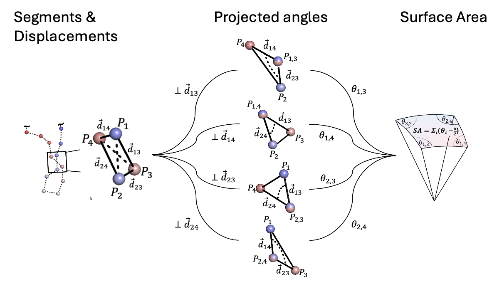
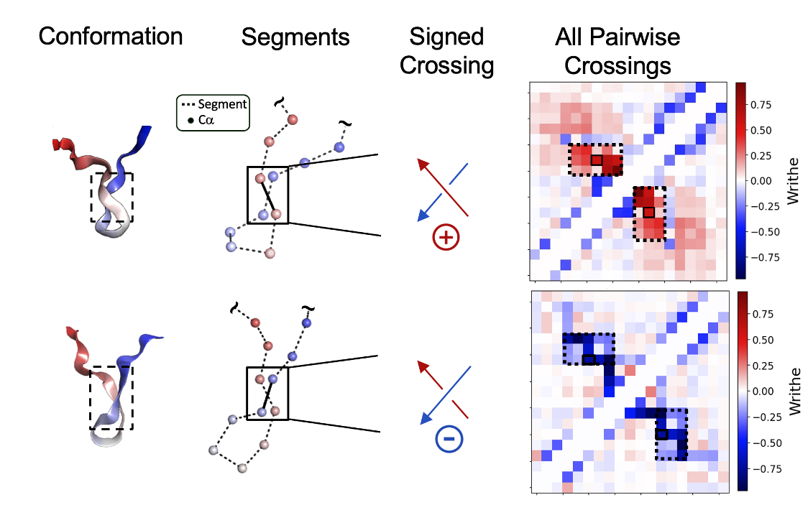

### Repository accompanying the paper:

'Characterizing the kinetic and structural ensembles of intrinsically disordered proteins using writhe' By Thomas Sisk, Simon Olsson and Paul Robustelli.

preprint: https://www.biorxiv.org/content/10.1101/2025.04.26.650781v1

<p align="center">
  
  
</p>

---

### Results

  - ##### Trajectory Analysis and Dynamic Modeling 

    - Demonstrations of the code to reproduce (or load and visualive) trajectory analysis and MSM results from the manscript are presented via jupyter notebooks 👉 [traj_analysis_results](./traj_analysis_results/). 

  - ##### Generative Modeling

    - Analysis of the samples generated from score-based DDPMs trained using the PaiNN and 'Writhe-PaiNN' architectures and scripts to train and sample either model 👉 [deep_generative_models](./deep_generative_models/).


---

# Data

The raw data pertaining to our results is available at: LINK TO DATA REPOSITORY
  - The data archive includes:
    - precomputed writhe features for segment lengths 1 to 5.
    - tCCA decompositions and VAMP2 scores for all writhe datasets considered in the paper.
    - Kmeans clusters estimated over a range of parameters.

# Software - ```writhe_tools```

  - Accompanying this project is an open-source python software package hosted and archived on the Python Package Index, PyPI : https://pypi.org/project/writhe-tools/

  - The package can be installed via:

```bash
pip install writhe-tools
```

  - Tutorial on how to use ```writhe_tools``` and the algorithm used to compute the writhe demonstrated through example analysis of ACTR 👉 [traj_analysis_results](./traj_analysis_results/writhe_demo.ipynb)

  - The ```writhe_tools``` package will be actively maintained at https://github.com/tommysisk/writhe_tools and new releases will be distributed on PyPI until further notice. Please direct all purely package related inquires accordingly. ```writhe_tools``` version 0.0.17 should be utilized when reproducing demonstrations of the code in this repository and is permenantly available via archive at https://pypi.org/project/writhe-tools . Future releases are not guarunteed to work with the sample code provided in this repository. 
